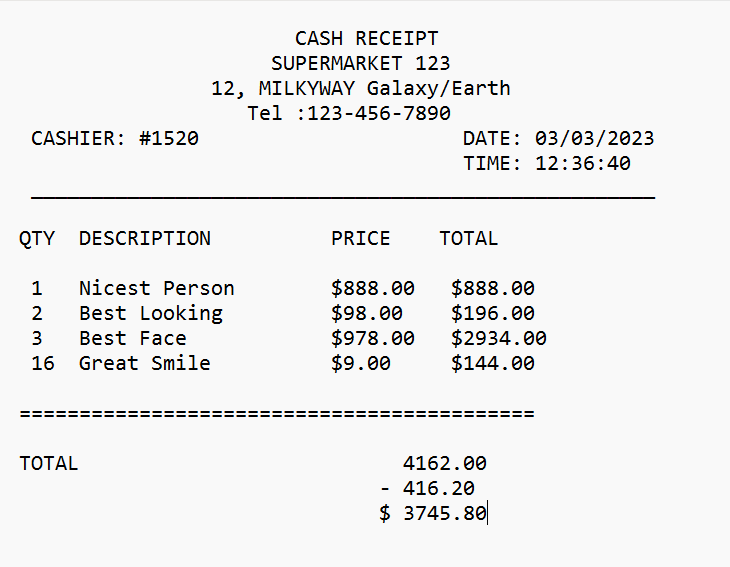
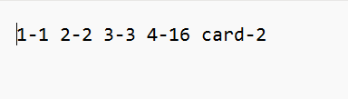
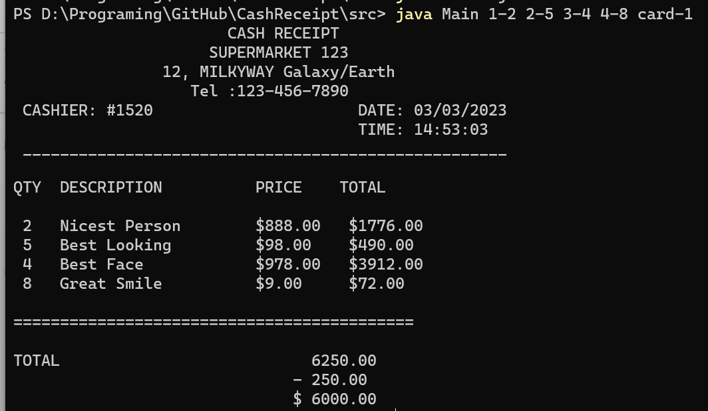
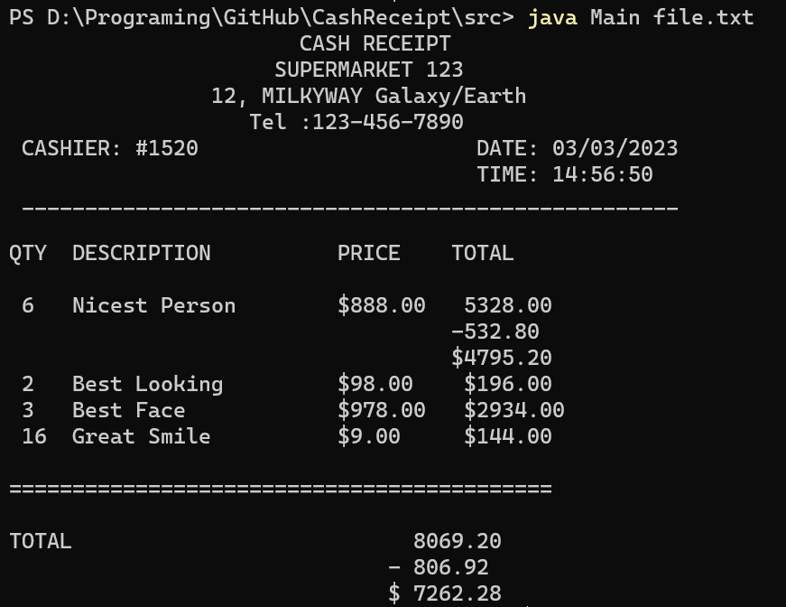

# Cash Receipt

## The application runs java mainClass.java.com.klachkova.cashReceipt.Main <set_parameters>, where the set of parameters in itemId-quantity format (itemId - item identifier, quantity - its quantity).
#
### For example: java mainClass.java.com.klachkova.cashReceipt.Main 3-1 2-5 5-1 card-1234 will generate and will display a mainClass.java.com.klachkova.cashReceipt.actions.receipt in the console containing the name of the mainClass.java.com.klachkova.cashReceipt.actions.product with id = 3 in the amount of 1 piece, the same with id = 2 in the amount of 5 pieces, id = 5 - one piece, etc. Card-1234 means that a mainClass.java.com.klachkova.cashReceipt.actions.discount card with the number 1234 was presented.

### A file containing the mainClass.java.com.klachkova.cashReceipt.actions.receipt will also be generated.

#
### It is possible to run the application java mainClass.java.com.klachkova.cashReceipt.Main <file_name>, the file type .txt contains a set of parameters in the format specified earlier.

#
### An example how you can do it in console:

* set_parameters
  
  

* file_name

#

***Among the goods there are promotional items. If there are more than five of them in the mainClass.java.com.klachkova.cashReceipt.actions.receipt, a 10% mainClass.java.com.klachkova.cashReceipt.actions.discount is made on that item. This information is reflected in the mainClass.java.com.klachkova.cashReceipt.actions.receipt.***

____
*Java 17.0.2.*
____
Patterns design:
+ Factory
+ Builder
+ Decorator
 